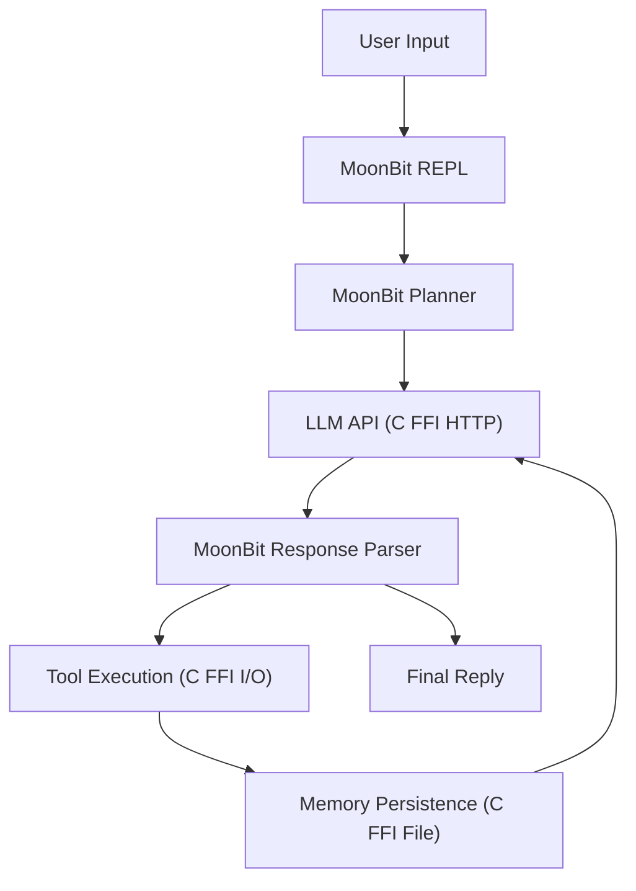

# AutoAgent Architecture

## 架构目标

AutoAgent 的目标是提供一个纯 MoonBit 实现的轻量 Agent CLI/runtime。MoonBit 负责所有逻辑决策，C FFI 仅负责 I/O 原语。

## 高层结构



## 核心原则

1. **MoonBit-first**：所有 agent 逻辑在 MoonBit 中实现
2. **C FFI 仅 I/O**：C 代码只提供 HTTP、文件、进程、环境变量原语
3. **单一二进制**：编译为一个原生可执行文件，无外部依赖
4. **集成测试优先**：遵循 Codex 原则，集成测试覆盖 agent 行为链路

## 模块职责

### REPL (`src/autoagent/repl.mbt`)

- 交互式命令循环
- Agent Loop（规划 → 调 LLM → 解析 → 执行工具 → 循环）
- 会话持久化（`.autoagent/workspace/sessions/`）
- 记忆持久化（`.autoagent/workspace/memory.json`）

### LLM Provider (`src/autoagent/llm_provider.mbt`)

- OpenAI-compatible Chat Completions API 客户端
- 环境变量 + 配置文件双重配置
- JSON 请求构建和响应解析

### 工具执行 (`src/autoagent/tools.mbt`)

- 5 个 I/O 工具：read_file, write_file, list_files, run_command, search_web
- 安全策略：路径限制、命令拒绝列表
- URL 编码和 HTML 解析

### 技能系统 (`src/autoagent/skill.mbt`)

- 7 个内置技能，14 个专用工具
- 目标驱动的技能选择
- 技能工具执行和结果返回

### C I/O 层 (`native/io.c`)

- HTTP：libcurl（无头文件依赖）
- 文件：POSIX (fopen/fread/fwrite/mkdir)
- 进程：popen
- 环境变量：getenv/setenv
- 工作目录：getcwd

### MoonBit FFI (`src/autoagent/io_native.mbt`)

- `#borrow` 注解的 extern "c" 声明
- String ↔ Bytes 转换（UTF-8 编解码）
- 平台特定编译（native/llvm vs wasm-gc/js）

### Eval 系统 (`src/autoagent/eval.mbt`)

- 测试用例定义（输入、期望工具、期望内容）
- 端到端评估执行
- 评估报告生成

## 数据流

```
用户输入
  ↓
MoonBit REPL
  ↓
MoonBit Planner → 步骤列表
  ↓
LLM API (C FFI HTTP) → 响应
  ↓
MoonBit Response Parser
  ├─→ Reply → 显示给用户
  └─→ CallTool → 工具执行 (C FFI I/O) → 结果 → 循环
  ↓
记忆持久化 (C FFI File)
```

## 安全模型

- 工具执行通过风险等级检查（默认只执行 Low）
- 文件路径限制在项目目录内
- 命令执行拒绝危险操作（rm, sudo, git clean 等）
- FFI 参数使用 `#borrow` 注解防止内存问题

## 构建流程

```
moon build --target native --release
  ↓
生成 main.c (MoonBit → C 编译)
  ↓
gcc -c native/io.c → io.o (C I/O 层编译)
  ↓
gcc -o main.exe main.c runtime.o io.o -lcurl (链接)
  ↓
单一原生二进制
```
