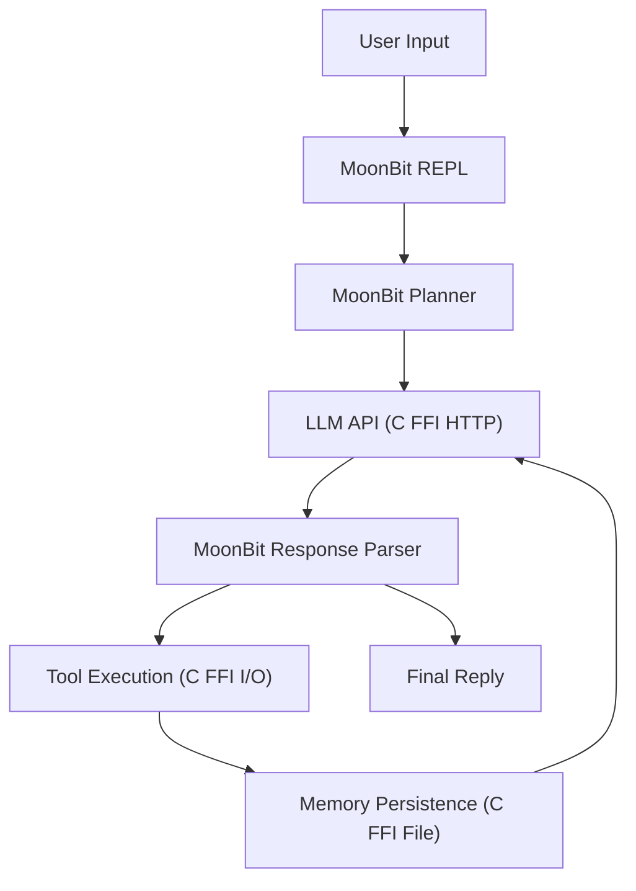

# AutoAgent Architecture

## 架构目标

AutoAgent 的目标是提供一个纯 MoonBit 实现的轻量 Agent CLI/runtime。MoonBit 负责所有逻辑决策，C FFI 仅负责 I/O 原语。

## 高层结构



## 核心原则

1. **MoonBit-first**：所有 agent 逻辑在 MoonBit 中实现
2. **C FFI 仅 I/O**：C 代码只提供 HTTP、文件、进程、环境变量原语
3. **单一二进制**：编译为一个原生可执行文件，无外部依赖
4. **集成测试优先**：遵循 Codex 原则，集成测试覆盖 agent 行为链路

## 模块职责

### REPL (`src/autoagent/repl.mbt`)

- 交互式命令循环
- Agent Loop（规划 → 调 LLM → 解析 → 执行工具 → 循环）
- 会话持久化（`.autoagent/workspace/sessions/`）
- 记忆持久化（`.autoagent/workspace/memory.json`）

### LLM Provider (`src/autoagent/llm_provider.mbt`)

- OpenAI-compatible Chat Completions API 客户端
- 环境变量 + 配置文件双重配置
- JSON 请求构建和响应解析

### 工具执行 (`src/autoagent/tools.mbt`)

- 83 个 runtime 工具：read_file, write_file, edit_file, list_files, run_command, search_web, find_files, code_search, git_status, git_diff, memory_write, memory_read, env_info, project_info, http_get, file_info, timestamp, env_get, string_replace, uuid_generate, get_cwd, head_file, tail_file, count_lines, grep_file, diff_files, copy_file, move_file, append_file, dir_size, disk_usage, sort_file, uniq_file, wc_file, basename, dirname, realpath, which, date, mkdir, is_dir, truncate_file, grep_count, grep_context, file_type, file_permissions, file_owner, file_modified, file_size, list_dir_detailed, find_by_type, find_by_size, grep_recursive, find_by_name, find_by_time, file_checksum, compress_file, decompress_file, tar_create, tar_extract, zip_create, zip_extract, is_readable, is_writable, is_executable, file_extension, file_lines, file_words, file_chars, system_info, memory_info, cpu_info, network_info, process_list, env_list, uptime, hostname, whoami, who, last, command_exists, shell_info, path_list
- 安全策略：路径限制、命令拒绝列表
- URL 编码和 HTML 解析

### 技能系统 (`src/autoagent/skill.mbt`)

- 10 个内置技能，20 个专用工具
- 目标驱动的技能选择
- 技能工具执行和结果返回
- 每个技能对应一个员工/专家角色，包含职责说明、关键词和工具清单

| 员工角色 | 职责 |
|----------|------|
| research | 调研来源、事实、风险和行动建议 |
| code-review | 审查正确性、可读性、设计、安全和性能 |
| docs | 生成技术文档草稿和概念解释 |
| testing | 设计测试计划和覆盖率补强方案 |
| code-gen | 按 TDD 顺序拆解实现和脚手架 |
| debug | 复现、隔离、定位、修复和预防问题 |
| refactor | 小步执行行为保持的代码改善 |
| security | 检查常见漏洞并给出修复策略 |
| performance | 定位瓶颈并给出可测量优化方案 |
| architecture | 拆分组件、定义接口和评审权衡 |

### C I/O 层 (`native/io.c`)

- HTTP：libcurl（无头文件依赖）
- 文件：POSIX (fopen/fread/fwrite/mkdir)
- 进程：popen
- 环境变量：getenv/setenv
- 工作目录：getcwd

### MoonBit FFI (`src/autoagent/io_native.mbt`)

- `#borrow` 注解的 extern "c" 声明
- String ↔ Bytes 转换（UTF-8 编解码）
- 平台特定编译（native/llvm vs wasm-gc/js）

### Eval 系统 (`src/autoagent/eval.mbt`)

- 测试用例定义（输入、期望工具、期望内容）
- 端到端评估执行
- 评估报告生成

## 数据流

```
用户输入
  ↓
MoonBit REPL
  ↓
MoonBit Planner → 步骤列表
  ↓
LLM API (C FFI HTTP) → 响应
  ↓
MoonBit Response Parser
  ├─→ Reply → 显示给用户
  └─→ CallTool → 工具执行 (C FFI I/O) → 结果 → 循环
  ↓
记忆持久化 (C FFI File)
```

## 安全模型

- 工具执行通过风险等级检查（默认只执行 Low）
- 文件路径限制在项目目录内
- 命令执行拒绝危险操作（rm, sudo, git clean 等）
- FFI 参数使用 `#borrow` 注解防止内存问题

## 构建流程

```
moon build --target native --release
  ↓
生成 main.c (MoonBit → C 编译)
  ↓
gcc -c native/io.c → io.o (C I/O 层编译)
  ↓
gcc -o main.exe main.c runtime.o io.o -lcurl (链接)
  ↓
单一原生二进制
```
