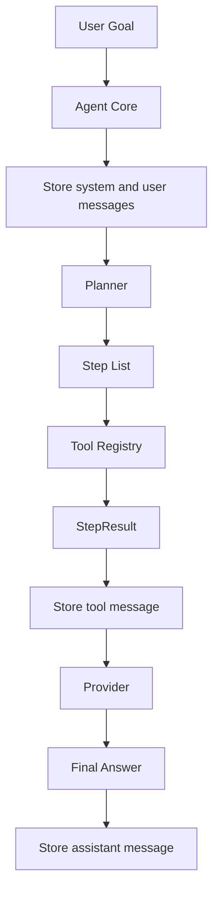

# AutoAgent Architecture

## 架构目标

AutoAgent 的目标是提供一个可阅读、可扩展、可教学的轻量 Agent Runtime。当前实现优先展示 Agent 的核心骨架：Agent Core、Planner、Tool、Memory 和 Provider。

## 高层结构



## 组件职责

### Agent Core

文件：`src/autoagent/agent.mbt`

`Agent` 是运行时的协调者，持有 `AgentConfig`、`Planner`、`Provider`、`Memory` 和 `Array[Tool]`。`Agent::run` 是简单入口，`Agent::run_trace` 是结构化调试入口。

执行流程：

1. 写入 system prompt。
2. 写入用户目标。
3. 检查用户目标长度是否超过 `max_goal_length`。
4. 调用 `Planner::plan` 生成步骤。
5. 对每个步骤调用 `Agent::invoke_step`。
6. 仅执行 `risk = Low` 的工具。
7. 将每个工具结果写入 Memory。
8. 工具失败时停止后续步骤。
9. 生成 `RunTrace`，记录状态、停止原因、步骤和观察结果。
10. 调用 `Provider::complete_trace` 生成最终响应。
11. 将最终响应写入 Memory 并返回。

### Planner

文件：`src/autoagent/planner.mbt`

`Planner` 使用 `max_steps` 控制返回步骤数量。当前计划固定为：

1. `scaffold`
2. `checklist`
3. `coach`

该模块的设计重点是隔离规划逻辑，让后续动态规划器替换时保持 `Agent` 主流程稳定。

### Tool Registry

文件：`src/autoagent/tool.mbt`

`Tool` 包含 `ToolSpec`，通过 `Tool::execute` 按工具名分发到内置实现。`find_tool` 在已注册工具数组中查找匹配工具。`ToolSpec` 当前包含工具名、描述、类别和风险等级。

当前工具：

- `scaffold`：生成搭建 Agent 的文件和测试建议。
- `checklist`：生成安全使用检查清单。
- `coach`：生成使用 Agent 的操作建议。

### Memory

文件：`src/autoagent/memory.mbt`

`Memory` 是运行期消息数组，支持容量限制和消息截断。当前只保存在内存中，提供：

- `Memory::new`：创建默认容量 Memory（100 条，2000 字符/条）。
- `Memory::new_with_limits`：创建自定义容量 Memory。
- `Memory::reset`：清空所有消息。
- `Memory::store`：追加消息，超长截断，超条数淘汰。
- `Memory::load`：返回消息数组。
- `Memory::summary`：渲染消息摘要。

### Provider

文件：`src/autoagent/provider.mbt`

`Provider` 当前是确定性响应生成器。`Provider::complete_trace` 将目标、状态、停止原因和工具观察结果拼成最终文本。

### Shared Types

文件：`src/autoagent/types.mbt`

共享类型包括：

- `Role`
- `Message`
- `Step`
- `StepResult`
- `ToolSpec`
- `ToolCall`
- `RiskLevel`
- `RunState`
- `StopReason`
- `RunTrace`

## 包结构

```txt
.
├── moon.mod
└── src
    ├── autoagent
    │   ├── agent.mbt
    │   ├── agent_test.mbt
    │   ├── memory.mbt
    │   ├── moon.pkg
    │   ├── planner.mbt
    │   ├── provider.mbt
    │   ├── tool.mbt
    │   └── types.mbt
    └── main
        ├── main.mbt
        └── moon.pkg
```

## 关键约束

- 工具执行必须通过注册表解析，保持 allowlist 边界。
- 工具执行必须通过风险等级检查，默认只执行低风险工具。
- 用户目标长度受 `max_goal_length` 限制，避免无界输入进入运行时。
- 工具失败后停止后续步骤，保持 fail-fast 语义。
- Provider 生成最终回答时使用 Memory 摘要和工具结果，保持可解释输出。
- Planner 使用 `max_steps` 截断步骤数量，避免无界执行。
- Agent 使用 `RunTrace` 暴露执行状态和停止原因，便于调试和审计。
- 当前示例只执行本地确定性文本逻辑，便于测试和教学。

## 可扩展点

- 将 `Provider` 替换为 LLM API adapter。
- 将 `Planner` 替换为基于模型或规则的动态规划器。
- 将 `Memory` 替换为持久化存储或检索记忆。
- 将 `Tool::execute` 扩展为带 schema 的工具调用协议。
