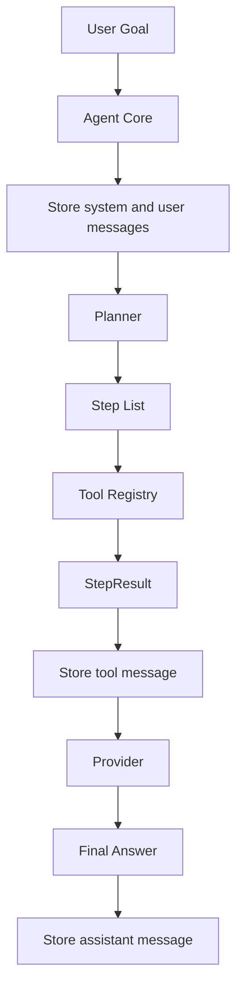

# AutoAgent Architecture

## 架构目标

AutoAgent 的目标是提供一个可阅读、可扩展、可交互的轻量 Agent Runtime。当前实现包含 Agent Core、Planner、Tool、Memory、Provider、CLI 入口和 Shell 会话层。

## 高层结构



## 组件职责

### Agent Core

文件：`src/autoagent/agent.mbt`

`Agent` 是运行时的协调者，持有 `AgentConfig`、`Planner`、`Provider`、`Memory` 和 `Array[Tool]`。`Agent::run` 是简单入口，`Agent::run_trace` 是结构化调试入口。

执行流程：

1. 写入 system prompt。
2. 写入用户目标。
3. 检查用户目标长度是否超过 `max_goal_length`。
4. 调用 `Planner::plan` 生成步骤。
5. 对每个步骤调用 `Agent::invoke_step`。
6. 仅执行 `risk = Low` 的工具。
7. 将每个工具结果写入 Memory。
8. 工具失败时停止后续步骤。
9. 生成 `RunTrace`，记录状态、停止原因、步骤和观察结果。
10. 调用 `Provider::complete_trace` 生成最终响应。
11. 将最终响应写入 Memory 并返回。

### Planner

文件：`src/autoagent/planner.mbt`

`Planner` 使用 `max_steps` 控制返回步骤数量，并根据目标关键词选择工具。新项目和构建类目标优先使用 `scaffold`，安全、测试和审查类目标优先加入 `checklist`，学习和指导类目标优先加入 `coach`。

1. `scaffold`
2. `checklist`
3. `coach`

对于 `build a chatbot for my website` 这类目标，Planner 会生成网站聊天机器人专属的执行理由。该模块的设计重点是隔离规划逻辑，让后续动态规划器替换时保持 `Agent` 主流程稳定。

### Tool Registry

文件：`src/autoagent/tool.mbt`

`Tool` 包含 `ToolSpec`，通过 `Tool::execute` 按工具名分发到内置实现。`find_tool` 在已注册工具数组中查找匹配工具。`ToolSpec` 当前包含工具名、描述、类别和风险等级。

当前工具：

- `scaffold`：生成实施脚手架。网站 chatbot 目标会包含前端 widget、`POST /api/chat`、Provider、记忆、知识源、安全和首个验收测试。
- `checklist`：生成安全和上线检查清单。网站 chatbot 目标会包含角色、输入、允许工具、记忆策略、停止条件和 launch gate。
- `coach`：生成交互式操作工作流。网站 chatbot 目标会包含初始化、逐轮测试、经验沉淀、偏好记忆和集成节奏。

### Interactive Shell

文件：`scripts/autoagent.sh`、`scripts/repl.sh`

Shell 会话层负责真实初始化和交互：

1. `init` 创建 `.autoagent/config.json` 和 `.autoagent/workspace/`。
2. `chat` 创建会话日志并进入交互循环。
3. 每轮输入调用 MoonBit 原生二进制执行一次 Agent run。
4. 每轮输出写入 `.autoagent/workspace/sessions/`。
5. `/save TEXT` 将经验追加到 `.autoagent/workspace/memory/experiences.md`。

### Memory

文件：`src/autoagent/memory.mbt`、`src/autoagent/memory_layer.mbt`

Memory 系统采用分层架构，参考 Hermes 记忆系统 2.0 设计：

| 层 | 用途 | 注入时机 |
|---|------|----------|
| Skeleton | 系统运行必须长期知道的稳定事实 | 默认注入 |
| User | 用户长期偏好和协作方式 | 默认注入 |
| Experiences | 实战验证过的坑、经验、模式 | 按需检索 |
| Sidecar | 当前会话活跃状态 | 会话内 |
| Archive | 不适合常驻注入但需保留的材料 | 仅追溯时 |

核心组件：

- `Memory`：单层存储，支持容量限制和消息截断。
- `LayeredMemory`：五层存储容器。
- `MemoryRouter`：写入分流、读取路由、上下文恢复。

写入分流规则：

- `System` 角色消息 → Skeleton 层
- `Tool`/`Assistant` 角色消息 → Sidecar 层
- `User` 角色消息根据前缀和长度分类到不同层

读取策略：

- `default_context()`：返回 Skeleton + User 层摘要（默认注入）
- `full_context()`：返回所有层摘要
- `recall(query)`：按关键词跨层检索
- `restore_context()`：按恢复顺序逐层输出

### Provider

文件：`src/autoagent/provider.mbt`

`Provider` 当前是确定性响应生成器。`Provider::complete_trace` 将目标、状态、停止原因和工具观察结果拼成最终文本。

### Shared Types

文件：`src/autoagent/types.mbt`

共享类型包括：

- `Role`
- `Message`
- `Step`
- `StepResult`
- `ToolSpec`
- `ToolCall`
- `RiskLevel`
- `RunState`
- `StopReason`
- `RunTrace`

## 包结构

```txt
.
├── moon.mod
└── src
    ├── autoagent
    │   ├── agent.mbt
    │   ├── agent_test.mbt
    │   ├── memory.mbt
    │   ├── moon.pkg
    │   ├── planner.mbt
    │   ├── provider.mbt
    │   ├── tool.mbt
    │   └── types.mbt
    └── main
        ├── main.mbt
        └── moon.pkg
```

## 关键约束

- 工具执行必须通过注册表解析，保持 allowlist 边界。
- 工具执行必须通过风险等级检查，默认只执行低风险工具。
- 用户目标长度受 `max_goal_length` 限制，避免无界输入进入运行时。
- 工具失败后停止后续步骤，保持 fail-fast 语义。
- Provider 生成最终回答时使用 Memory 摘要和工具结果，保持可解释输出。
- Planner 使用 `max_steps` 截断步骤数量，避免无界执行。
- Agent 使用 `RunTrace` 暴露执行状态和停止原因，便于调试和审计。
- 当前示例只执行本地确定性文本逻辑，便于测试和教学。

## 可扩展点

- 将 `Provider` 替换为 LLM API adapter。
- 将 `Planner` 替换为基于模型或规则的动态规划器。
- 将 `Memory` 替换为持久化存储或检索记忆。
- 将 `Tool::execute` 扩展为带 schema 的工具调用协议。
