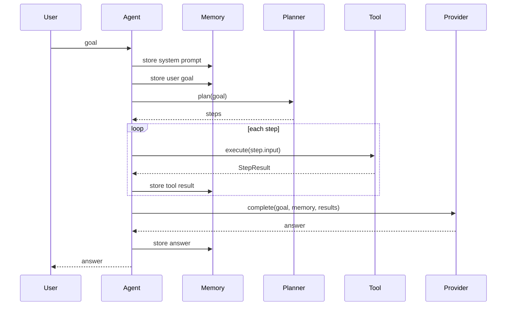

# Agent Loop

Agent Loop 是 AutoAgent 的核心执行语义。项目包含 legacy deterministic loop 和当前 REPL loop 两条路径：`src/autoagent/agent.mbt` 提供可测试的确定性 loop，`src/autoagent/repl.mbt` 提供面向 CLI 的 LLM tool-call loop。

## Current Flow

## Semantics

- 每次 `Agent::run` 会将 system prompt 和用户目标写入 Memory。
- Planner 生成步骤数组。
- Agent 逐个执行步骤。
- 步骤执行通过工具注册表解析。
- 工具执行结果统一写入 Memory。
- Provider 使用目标、Memory 摘要和工具结果生成最终响应。

## Current Boundaries

- Legacy deterministic loop 按 Planner 步骤数组顺序执行，用于稳定测试和教学说明。
- REPL loop 支持 LLM 生成 `tool` fenced block 后执行 runtime tools，并把工具结果送回对话上下文。
- 人工批准、dry-run、结构化 ToolCall schema 和复杂反思策略属于后续增强。

## Evolution Direction

- 增加 tool approval hook。
- 增加结构化 ToolCall schema。
- 增加 planner feedback loop。
- 将 REPL loop trace 与 legacy `RunTrace` 对齐。
- 增加 run summary。
