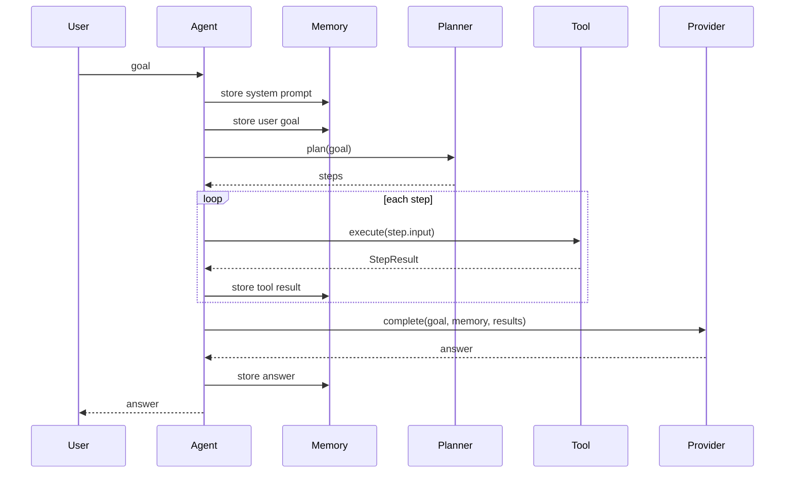

# Agent Loop

Agent Loop 是 AutoAgent 的核心执行语义。当前实现位于 `src/autoagent/agent.mbt` 的 `Agent::run`。

## Current Flow

## Semantics

- 每次 `Agent::run` 会将 system prompt 和用户目标写入 Memory。
- Planner 生成步骤数组。
- Agent 逐个执行步骤。
- 步骤执行通过工具注册表解析。
- 工具执行结果统一写入 Memory。
- Provider 使用目标、Memory 摘要和工具结果生成最终响应。

## Current Limitations

- 循环当前按步骤数组顺序执行，尚未实现动态反思或 ReAct 式迭代。
- 当前 Provider 只做确定性拼接，尚未生成新的工具调用。
- 当前没有中断、重试或人工批准机制。

## Evolution Direction

- 增加 stop condition。
- 增加 tool approval hook。
- 增加 planner feedback loop。
- 增加 structured trace。
- 增加 run summary。
