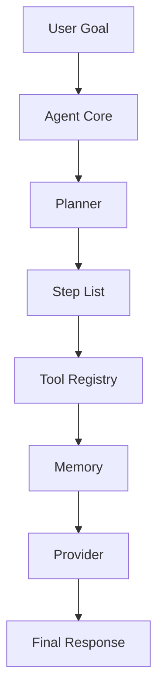

# AutoAgent

Feature Name: autoagent
Updated: 2026-05-28

## Description

AutoAgent is a lightweight MoonBit implementation inspired by small Agent runtimes such as Nanobot-style and ZeroClaw-style designs. The system keeps the runtime readable and modular: Agent Core coordinates Planner, Tool Registry, Memory, and Provider, while the default tools focus on teaching users how to build and use agents.

## Architecture

The design follows a small-runtime structure. `Agent` owns the run loop, `Planner` creates a bounded plan, `Tool` executes allowlisted actions, `Memory` records messages, and `Provider` renders the final response.

## Components and Interfaces

- `Agent`: owns configuration, planner, provider, memory, and tools.
- `Planner`: converts a goal into `Array[Step]` with a configurable maximum number of steps.
- `Tool`: contains metadata and executes allowlisted text-generation helpers.
- `Memory`: stores `Message` values and renders a textual summary.
- `Provider`: composes the final answer from goal, memory summary, and tool results.
- `types`: defines `Role`, `Message`, `Step`, `StepResult`, `ToolSpec`, and rendering helpers.

## Data Models

- `Message`: `{ role: Role, content: String }`.
- `Step`: `{ id: Int, action: String, input: String, reason: String }`.
- `StepResult`: `Success(String)` or `Failure(String)`.
- `ToolSpec`: `{ name: String, description: String, category: String, risk: RiskLevel }`.
- `RiskLevel`: `Low`, `Medium`, or `High`.
- `AgentConfig`: `{ name: String, system_prompt: String, max_steps: Int, max_goal_length: Int, max_tool_output_length: Int }`.
- `RunState`: `Ready`, `Running`, `Completed`, or `Failed`.
- `StopReason`: `CompletedAllSteps`, `EmptyGoal`, `InputTooLong`, or `ToolFailure(String)`.
- `RunTrace`: `{ goal, state, stop_reason, steps, observations, answer }`.

## Correctness Properties

- The Agent Core executes only steps that resolve to registered low-risk tools.
- Non-low-risk tools return a failure requiring approval.
- The Planner returns at most `max_steps` steps.
- Every executed step records a tool message in memory.
- The default Agent produces scaffold, checklist, and coaching guidance for a goal.
- Goals exceeding `max_goal_length` are rejected before execution.
- Tool outputs exceeding `max_tool_output_length` are truncated.
- Tool failures stop subsequent steps (fail-fast).
- Memory has capacity limits (`max_messages`, `max_message_length`).

## Error Handling

- Unknown tool actions return `Failure` with the missing action name.
- Non-low-risk tools return `Failure` requiring approval.
- Goals exceeding `max_goal_length` return `InputTooLong` stop reason.
- Empty goals return `EmptyGoal` stop reason.
- Tool failures return `ToolFailure` stop reason and stop subsequent steps.
- Memory auto-truncates long messages and auto-evicts old messages.
- The default provider is deterministic so local runs remain reproducible.

## Test Strategy

- Unit tests verify that the default Agent includes identifying text and core tool outputs.
- Boundary tests verify `max_goal_length` acceptance and rejection.
- Risk tests verify non-low-risk tools are rejected.
- Fail-fast tests verify tool failures stop subsequent steps.
- Memory tests verify message order and summary format.
- Provider tests verify trace output format.
- Future provider adapters should use contract tests that avoid live network calls by default.
- Future external tools should use allowlist tests and dry-run behavior tests.

## References

[^1]: (Website) - MoonBit documentation project structure and CLI usage: https://github.com/moonbitlang/moonbit-docs
[^2]: (Website) - Nanobot architecture analysis search results highlighting Agent loop, memory, tools, and channels.
