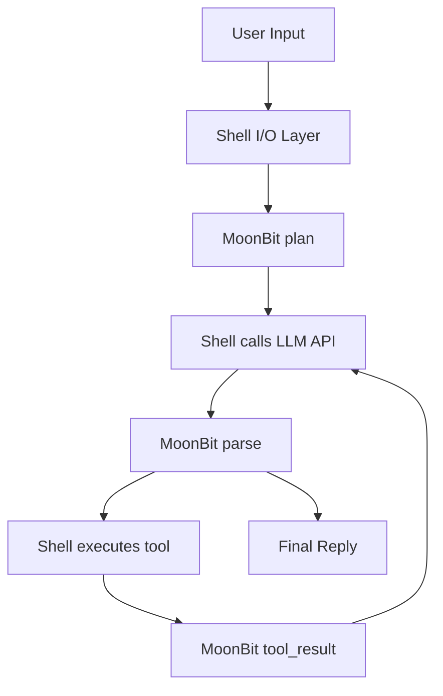

# AutoAgent

AutoAgent 是一个 MoonBit-first 的轻量 Agent CLI/runtime。MoonBit 负责规划、状态、记忆建模、skill 选择、LLM 响应解析和工具调用决策；Shell 只负责 LLM HTTP、文件系统、命令执行和网络搜索这些 I/O 工作。

## 当前状态

- MoonBit core 已可独立构建、测试和通过 JSON protocol 驱动。
- 交互式 CLI 可通过 `scripts/autoagent.sh` 运行，支持真实 LLM、工具执行和会话记忆。
- 无 API key 时自动回退到 MoonBit deterministic provider，测试默认不依赖网络。
- 默认安全策略拒绝高风险命令和项目目录外路径。

## Architecture



## Quick Start

```bash
# Type check
PATH="$HOME/.moon/bin:$PATH" moon check

# Run tests
PATH="$HOME/.moon/bin:$PATH" moon test

# Build native runtime
PATH="$HOME/.moon/bin:$PATH" moon build --target native --release

# Initialize workspace
./scripts/autoagent.sh init

# Run one task
./scripts/autoagent.sh run "build a chatbot"

# Start interactive chat
./scripts/autoagent.sh chat
```

## LLM 配置

AutoAgent 使用 OpenAI-compatible Chat Completions API。

```bash
export MCAI_LLM_API_KEY="..."
export MCAI_LLM_BASE_URL="https://proxy.monkeycode-ai.com/v1"
export MCAI_LLM_MODEL="monkeycode-basic/qwen3.5-plus"
```

也可以编辑 `.autoagent/config.json`。环境变量优先级更高。

## MoonBit JSON Protocol

构建后的二进制路径：`_build/native/release/build/src/main/main.exe`。

```bash
./_build/native/release/build/src/main/main.exe --json '{"cmd":"plan","goal":"build a chatbot"}'
./_build/native/release/build/src/main/main.exe --json '{"cmd":"parse","response":"Hello"}'
./_build/native/release/build/src/main/main.exe --json '{"cmd":"tool_result","tool":"read_file","result":"content"}'
```

输出 action：

- `think`：Shell 应调用 LLM。
- `tool`：Shell 应执行指定工具。
- `reply`：Shell 应展示最终回复。
- `error`：Shell 应展示错误。

## Tools

交互脚本提供这些 I/O 工具：

- `read_file`：读取项目内文件。
- `write_file`：写入项目内文件，输入为 `{"path":"...","content":"..."}`。
- `list_files`：列出项目内目录。
- `run_command`：执行本地开发命令，带安全拒绝列表。
- `search_web`：使用 DuckDuckGo HTML 搜索。

MoonBit 通过 fenced tool block 解析工具调用：

````text
```tool
{"name":"read_file","input":"README.md"}
```
````

## Skills

内置 4 个 skill，提供 8 个专用工具：

| Skill | 工具 | 用途 |
|-------|------|------|
| research | research-search, research-summarize | 信息搜索与综合 |
| code-review | review-analyze, review-suggest | 代码质量分析 |
| docs | docs-generate, docs-explain | 文档生成与解释 |
| testing | test-create, test-coverage | 测试计划与覆盖率 |

```bash
./_build/native/release/build/src/main/main.exe --skills
./_build/native/release/build/src/main/main.exe --skill research
```

## Project Layout

```txt
.
├── Makefile
├── README.md
├── scripts/
│   └── autoagent.sh
├── src/
│   ├── autoagent/
│   │   ├── agent.mbt
│   │   ├── agent_loop.mbt
│   │   ├── agent_protocol.mbt
│   │   ├── memory.mbt
│   │   ├── planner.mbt
│   │   ├── provider.mbt
│   │   ├── skill.mbt
│   │   ├── tool.mbt
│   │   └── types.mbt
│   └── main/
│       └── main.mbt
└── .monkeycode/docs/
```

## Quality Gate

```bash
PATH="$HOME/.moon/bin:$PATH" moon check
PATH="$HOME/.moon/bin:$PATH" moon test
PATH="$HOME/.moon/bin:$PATH" moon build --target native --release
make all
```

当前测试覆盖核心 agent、planner、memory、skills、CLI args 和 MoonBit JSON protocol。

## Documentation

- `.monkeycode/docs/ARCHITECTURE.md`：架构和组件职责。
- `.monkeycode/docs/INTERFACES.md`：公开类型、函数和 JSON protocol。
- `.monkeycode/docs/USAGE.md`：使用手册。
- `.monkeycode/docs/DEVELOPER_GUIDE.md`：开发指南。
- `.monkeycode/docs/ROADMAP.md`：演进计划。

## Security Baseline

- MoonBit core 默认只执行 `RiskLevel.Low` 工具。
- Shell I/O 层限制文件路径在项目目录内。
- `run_command` 拒绝删除、提权、系统管理和高风险命令。
- 默认测试和 deterministic provider 不依赖真实网络或 LLM。

AutoAgent 的关键边界是 MoonBit 做决策，Shell 做 I/O。
