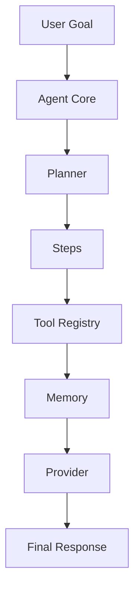

# AutoAgent

AutoAgent 是一个使用 MoonBit 编写的轻量级 Agent Runtime。当前版本提供初始化、交互式会话、分层记忆目录、确定性本地运行和可审计 trace，目标是让用户从一次性 demo 进入可持续迭代的 Agent 工作流。

## Design Goals

- Lightweight core: Agent loop, planner, memory, provider, and tools are separate modules.
- Learnable architecture: each component is small enough to read directly.
- Interactive workflow: `init` creates workspace files and `chat` keeps a persisted session log.
- Safe defaults: the default tools only generate text guidance and run low-risk tools.
- Extensible shape: replace `Provider`, add `Tool`, or customize `Planner` to grow the runtime.

## Core Flow

AutoAgent follows a compact loop:

1. Store the system prompt and user goal in memory.
2. Ask the planner for a bounded list of steps.
3. Resolve each step against the allowlisted tool registry.
4. Store every tool result in memory.
5. Ask the provider to compose the final response.

The default provider is deterministic, so the project can be understood and tested before connecting a real LLM.

## Architecture



## Documentation

完整项目文档位于 `.monkeycode/docs/`：

- `.monkeycode/docs/INDEX.md`：文档索引和项目概览。
- `.monkeycode/docs/USAGE.md`：使用手册，快速开始、配置、工具开发和 API 速查。
- `.monkeycode/docs/ARCHITECTURE.md`：系统架构和组件职责。
- `.monkeycode/docs/INTERFACES.md`：公开类型、函数和命令入口。
- `.monkeycode/docs/DEVELOPER_GUIDE.md`：开发、测试和扩展指南。
- `.monkeycode/docs/ROADMAP.md`：项目演进计划。
- `.monkeycode/workspace/README.md`：项目过程资料工作目录。
- `.monkeycode/workspace/STATE_LOG.md`：项目阶段状态变迁记录。

需求和设计规格位于 `.monkeycode/specs/autoagent/`。
规约、流程、测试、示例和参考资料位于 `.monkeycode/workspace/`。

## Project Layout

```txt
.
├── .autoagent/
│   └── config.json
├── moon.mod
├── README.md
└── src
    ├── autoagent
    │   ├── agent.mbt
    │   ├── agent_test.mbt
    │   ├── cli.mbt
    │   ├── config.mbt
    │   ├── memory.mbt
    │   ├── moon.pkg
    │   ├── planner.mbt
    │   ├── provider.mbt
    │   ├── tool.mbt
    │   └── types.mbt
    └── main
        ├── main.mbt
        └── moon.pkg
```

## Usage

Install the MoonBit toolchain from the official MoonBit distribution, then run:

```bash
# Install MoonBit toolchain on Linux or macOS
curl -fsSL https://cli.moonbitlang.cn/install/unix.sh | bash

# Build the project
moon build

# Run tests
moon test

# Initialize AutoAgent workspace
make init

# Start an interactive session
make repl

# Run one-shot mode with a custom goal
moon run src/main -- "build a chatbot for my website"

# Show help
moon run src/main -- --help

# Show configuration
moon run src/main -- --config

# Verbose output
moon run src/main -- --verbose "create a research assistant"
```

This project has been verified with `moonc v0.9.3+b53c2807d` and `moon 0.1.20260522`.

Running without a goal prints the interactive entrypoints. Use `make repl` or `./scripts/autoagent.sh chat` for ongoing work.

## Interactive Workflow

```bash
# Build and initialize .autoagent/workspace
make init

# Start an interactive shell
make repl
```

The interactive shell creates:

- `.autoagent/workspace/sessions/` for session transcripts.
- `.autoagent/workspace/memory/user.md` for stable user preferences.
- `.autoagent/workspace/memory/experiences.md` for validated outcomes and regressions.
- `.autoagent/workspace/memory/archive.md` for long transcripts.

Useful session commands:

- `/status` shows the active workspace and session file.
- `/history` prints the current session log.
- `/memory` shows memory file locations.
- `/save TEXT` appends an experience to memory.
- `/run N` changes max steps for later turns.

## Build & Package

### Build Targets

```bash
# Build native binary (Linux/macOS)
make build-native

# Build wasm-gc (default)
make build-wasm

# Run all checks and build
make all

# Create distribution package
make dist

# Clean build artifacts
make clean
```

### Distribution Package

```bash
# Create distribution archive
make dist
```

产物：`_build/autoagent-0.1.0-linux-x86_64.tar.gz`

包含内容：
- `autoagent`：原生可执行文件
- `.autoagent/config.json`：配置文件模板

### 使用方式

```bash
# 解压
tar -xzf autoagent-0.1.0-linux-x86_64.tar.gz
cd autoagent

# 运行
./autoagent --help
./autoagent "build a chatbot for my website"
./autoagent --config
./autoagent --verbose --max-steps 5 "create a research assistant"
```

### 跨平台说明

当前构建目标为 Linux x86_64。MoonBit 原生编译依赖平台 C 编译器：

| 平台 | 构建命令 | 说明 |
|------|----------|------|
| Linux x86_64 | `make build-native` | 当前默认 |
| macOS | `make build-native` | 需要 macOS 环境构建 |
| Windows | `make build-native` | 需要 Windows + MSVC 环境 |

如需在当前平台构建其他平台的二进制，需要在目标平台执行构建。

### Makefile 目标

| 目标 | 说明 |
|------|------|
| `make all` | 检查 + 测试 + 构建原生二进制 |
| `make build` | 构建 wasm-gc |
| `make build-native` | 构建原生二进制 |
| `make build-wasm` | 构建 wasm-gc |
| `make test` | 运行测试 |
| `make check` | 类型检查 |
| `make dist` | 创建发布包 |
| `make init` | 初始化 `.autoagent/workspace` |
| `make chat` | 启动交互式会话 |
| `make repl` | 启动交互式会话 |
| `make clean` | 清理构建产物 |
| `make run` | 构建并运行 |
| `make run ARGS="--help"` | 构建并运行（带参数） |

## Review Criteria

项目 review 以三个维度作为质量门槛：

- 鲁棒性：空目标、未知工具、工具失败和边界步数都应返回可解释结果。
- 可行性：默认流程应能在本地 MoonBit 工具链下完成构建、测试和 demo 运行。
- 卓越性：架构应保持小核心、明确扩展点、确定性测试和可追踪过程资料。

## Security Baseline

当前安全基线：

- 默认只执行 `risk = Low` 的工具。
- 中高风险工具返回需要批准的失败结果。
- 用户目标超过 `max_goal_length` 时停止执行。
- 工具失败后停止后续步骤，避免继续扩大影响。
- 默认工具只生成文本建议，不执行网络、文件或 shell 操作。

## Performance Test

当前实现是确定性本地文本运行时，性能测试重点关注 Agent loop 的固定步骤开销、测试套件耗时和 demo 响应时间。

推荐命令：

```bash
# Measure full test suite runtime
time PATH="$HOME/.moon/bin:$PATH" moon test

# Measure demo runtime
time PATH="$HOME/.moon/bin:$PATH" moon run src/main
```

性能验收口径：

- `moon test` 应在本地开发环境中稳定通过，且测试数量增长时保持可接受耗时。
- `moon run src/main` 应快速输出完整 trace，默认三步计划不应出现无界循环。
- 引入真实 Provider、外部工具或持久化 Memory 后，需要新增对应的基准场景和超时策略。

## Default Tools

- `scaffold`: recommends the first files and acceptance test for a new Agent.
- `checklist`: gives a safe operating checklist.
- `coach`: teaches the user how to operate and improve the Agent.

## Extending AutoAgent

1. Add a tool in `src/autoagent/tool.mbt` by creating a new `Tool::execute` branch.
2. Add a planning step in `src/autoagent/planner.mbt`.
3. Replace `Provider::complete_trace` with an LLM provider adapter.
4. Keep tool execution allowlisted and keep memory policy explicit.

## Roadmap

AutoAgent 的演进计划见 `.monkeycode/docs/ROADMAP.md`。当前重点阶段是 Runtime Hardening，包括 Planner、Tool、Memory 的测试覆盖、空目标处理和未知工具失败路径。

## Process Workspace

项目过程资料集中在 `.monkeycode/workspace/`：

- `CONVENTIONS.md`：项目规约。
- `PROCESS.md`：流程指引。
- `TESTING.md`：测试资料。
- `EXAMPLES.md`：示例资料。
- `REFERENCES.md`：参考资料。
- `STATE_LOG.md`：阶段状态记录。
